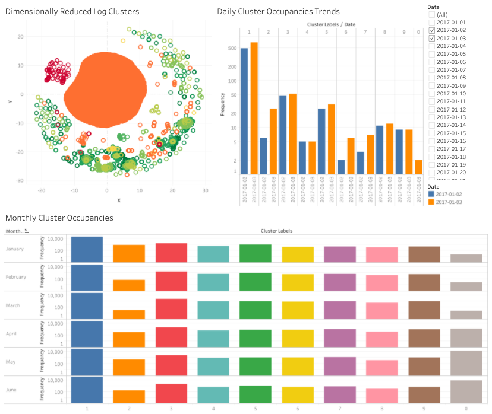

# Log Analysis on EDGAR Log File Data Set

The goal of this project is to use clustering algorithms to recognize log patterns in the EDGAR log files data set. By recognizing general log patterns from billions of logs, we can gain a better understanding of user activities.

**The Data**
The Securities and Exchange Commission (SEC) is a collection of web server log files that allow researchers to study the demand for SEC filings. I ingested 500GB of log data, which is about 4.5 billion rows of log messages for batch processing. 

**The Batch Processing Pipeline**
This is my batch processing pipeline. I used an EC2 instance to ingest my data from the SEC website to S3. Using an EMR cluster for batch processing, I pre-processed the data in Spark, then I did KMeans clustering and PCA for dimensional reduction and visualization. Then I stored the result in S3 and used Tableau for the front end.

**Challenges**

* The first issue is that CSV files are slow to be parsed in spark. I transformed the data into a parquet columnar format, and reading the data into Spark became 6x faster.
* There are over 262K distinct documents viewed by ip addresses in the data. To make the data processing faster, I chose to focus on the most relevant features. So I ignored the documents that were viewed by < 1% of the users. Since these documents are only infrequently viewed, ignoring them will have minimal effect on the patterns that I discovered but significantly speeded up the calculation by 23%.  
* To visualize the high-dimensional data, I use PCA for dimensionality reduction. 

**Result: Compare Trends and Detect Anomalies**
Here is the dashboard displaying some visualization of my log similarity analysis. On the left, you can see the dimensionally reduced clusters of users based on their activities. On the right, you can filter the cluster occupancies by date. Below, you can see monthly cluster occupancies to detect longer-term trends. For example, from Q1 to Q2, cluster 0 increased in size.

